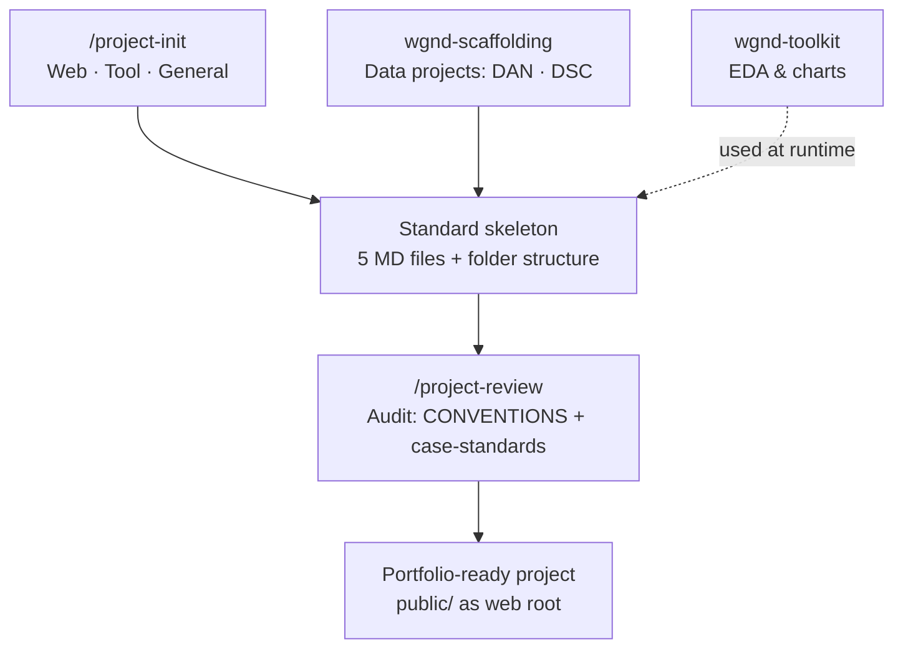
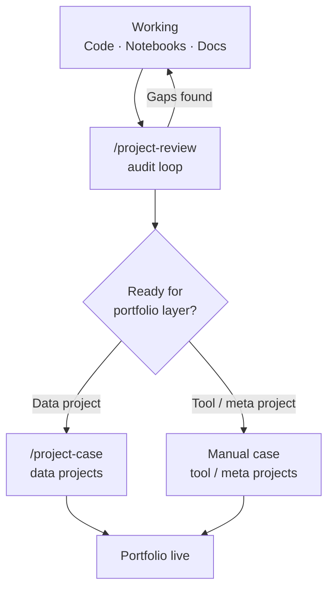
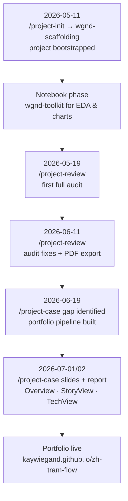

# wgnd-ai-dev-toolchain

**An AI-orchestrated dev toolchain — like Cookiecutter or Yeoman, but with an AI layer driving
bootstrap, review, and portfolio packaging instead of static templates alone.**

Every new data project starts with the same repetitive setup: the same folder structure, the
same five documentation files, the same EDA boilerplate, the same audit checklist before
anything is portfolio-ready. Doing that by hand every time is slow and inconsistent — details
get skipped under time pressure, conventions drift between projects, and nothing enforces that
a "finished" project actually meets a fixed quality bar. This toolchain splits the work along a
clear line: deterministic, repeatable steps (folder structure, boilerplate, artifact generation)
are handled by scripts, while judgment calls (is this project's story coherent? is the code
quality real or superficial? which slides go in which presentation?) are handled by Claude Code
skills that reason about the actual content instead of just filling in a template.

This repo has no code of its own — it documents how the three functioning pieces work together,
and shows the workflow being used end-to-end on a real project.

---

## The three pieces

| Repo | Role | Type |
| :--- | :--- | :--- |
| [wgnd-scaffolding](https://github.com/kaywiegand/wgnd-scaffolding) | Deterministic project generator for data projects | CLI |
| [wgnd-toolkit](https://github.com/kaywiegand/wgnd-toolkit) | EDA/visualization helpers used inside the generated notebooks | Python package |
| [wgnd-skills](https://github.com/kaywiegand/wgnd-skills) | Claude Code skills driving bootstrap, audit, and portfolio packaging | Claude Code skills |

### [wgnd-scaffolding](https://github.com/kaywiegand/wgnd-scaffolding)

A CLI that writes the standard skeleton for a new data project in one shot: the folder layout
(`data/raw|interim|processed`, `notebooks/`, `src/`, `tests/`), the five baseline documentation
files (`CLAUDE.md`, `PROCESS_LOG.md`, `ROADMAP.md`, `BACKLOG.md`, `README.md`), and a
`pyproject.toml` matching the project type. It distinguishes two data-project types — DAN (Data
Analysis) and DSC (Data Science) — and initializes git for the new project automatically. The
point isn't cleverness, it's determinism: run it twice with the same input, get the same
skeleton, every time. That reliability is what makes it safe for `/project-init` to delegate to
it without supervision.

### [wgnd-toolkit](https://github.com/kaywiegand/wgnd-toolkit)

A small Python package of reusable EDA and visualization helpers — inspection functions
(duplicates, correlations, missing values), themed Plotly chart builders, and export utilities —
imported inside the notebooks that `wgnd-scaffolding` generates. It exists so that every project
doesn't reinvent the same `df.duplicated()` sanity-check or restyle its charts from scratch;
one shared, tested library means a fix or a style change propagates to every project that
imports it, instead of being copy-pasted and drifting.

### [wgnd-skills](https://github.com/kaywiegand/wgnd-skills)

Three Claude Code skills that cover the parts of the lifecycle that need judgment, not just
mechanics:

- **`/project-init`** — the single entry point for starting a new project. For data projects it
  delegates to `wgnd-scaffolding`; for web/tool/general projects it writes its own generic docs.
- **`/project-review`** — a read-only audit loop. Checks project structure, README quality,
  coherence between documentation files, and git hygiene against a fixed standard
  (`case-standards.md`), and reports gaps instead of silently accepting a half-finished project.
- **`/project-case`** — builds the actual portfolio artifacts for a data project once it passes
  review: extracts the story, drives an interactive slide-authoring dialog (`slides.yaml`), and
  generates the presentation views + navigation hub via a mechanical build pipeline.

---

## Architecture

`/project-init` is the single entry point. For data projects it delegates to `wgnd-scaffolding`;
for web/tool/general projects it writes its own generic docs. Either way, the result is a
standard skeleton that `wgnd-toolkit` gets used inside of, and that `/project-review` later
audits against a fixed quality bar.

---

## Workflow

`/project-review` is a loop, not a gate you pass once — it runs repeatedly until the project
clears the bar. Only then does `/project-case` (data projects) or a manual write-up (tool/meta
projects, like this repo) turn it into portfolio artifacts.

---

## In practice — zh-tram-flow

Not a design exercise — this is what actually happened building
[zh-tram-flow](https://github.com/kaywiegand/zh-tram-flow), a tram-delay analysis + prediction
portfolio project:

The interesting detail is step E: `/project-case` didn't exist in finished form when
zh-tram-flow needed it. The skill was built *during* the project, driven by a concrete gap
(no mechanized way to generate the three presentation views), then generalized into
`wgnd-skills` so the next project gets it for free. The toolchain and the portfolio project
co-evolved — the tooling wasn't designed upfront in isolation.

---

## Why this exists

Bootstrapping, reviewing, and packaging a data project by hand is repetitive and error-prone —
the same five MD-files, the same audit checklist, the same artifact pipeline, every time.
This toolchain automates the mechanical parts and uses Claude Code skills for the parts that
need judgment (does this project actually tell a coherent story? is the code quality real or
superficial?) — a division of labor between deterministic scripts and an AI reviewer, not
"AI does everything" or "AI does nothing."

Full documentation of each piece lives in its own repo — see the links above.
