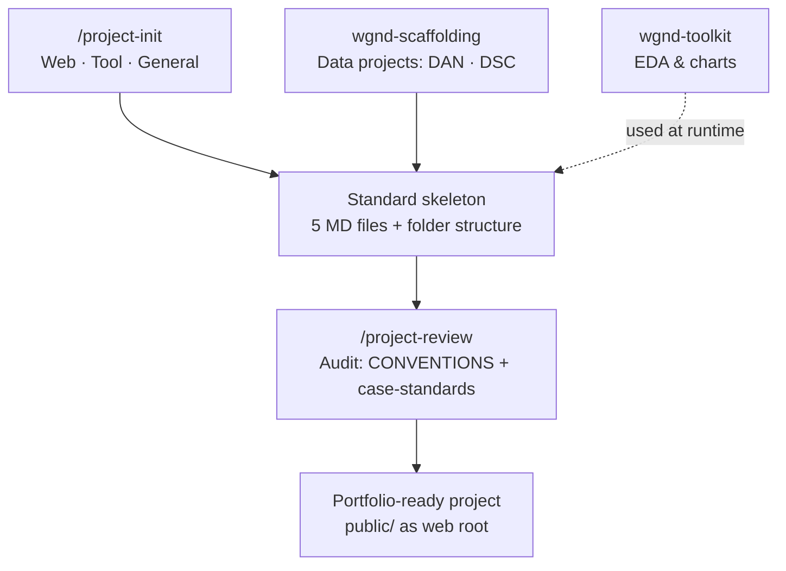
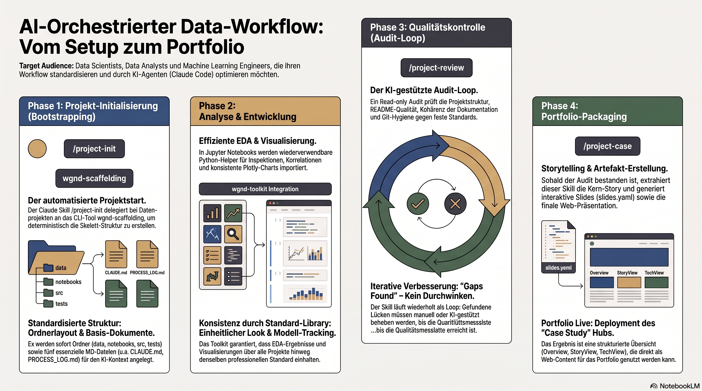
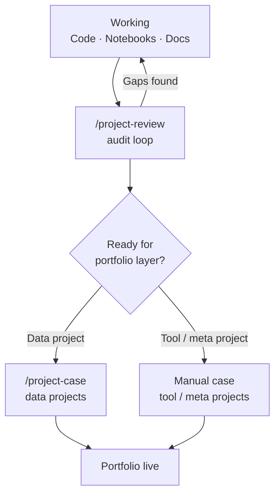
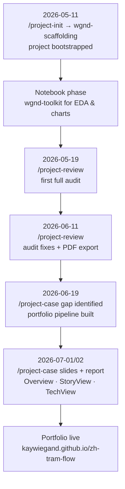

# wgnd-ai-dev-toolchain

**Eine KI-orchestrierte Entwickler-Toolchain – vergleichbar mit Cookiecutter oder Yeoman, jedoch mit einer KI-Schicht, die Bootstrap, Review und Portfolio-Aufbereitung steuert, anstatt sich ausschließlich auf statische Templates zu verlassen.**

Jedes neue Datenprojekt beginnt mit denselben wiederkehrenden Einrichtungsschritten: derselben Ordnerstruktur, denselben fünf Dokumentationsdateien, demselben EDA-Grundgerüst und derselben Audit-Checkliste, bevor ein Projekt überhaupt portfoliofähig ist. Das jedes Mal von Hand zu erledigen, ist langsam und inkonsistent – unter Zeitdruck werden Details ausgelassen, Konventionen unterscheiden sich von Projekt zu Projekt, und nichts stellt sicher, dass ein „fertiges“ Projekt tatsächlich einen festen Qualitätsstandard erfüllt. Diese Toolchain trennt die Arbeit klar auf: deterministische, wiederholbare Schritte (Ordnerstruktur, Boilerplate, Artefakt-Generierung) werden von Skripten übernommen, während Entscheidungen mit fachlichem Urteilsvermögen (ist die Story des Projekts schlüssig? Ist die Codequalität tatsächlich gut oder nur oberflächlich? Welche Folien gehören in welche Präsentation?) von Claude-Code-Skills getroffen werden, die den tatsächlichen Inhalt analysieren, anstatt lediglich Vorlagen auszufüllen.

Dieses Repository enthält keinen eigenen Code – es dokumentiert, wie die drei funktionierenden Bestandteile zusammenspielen, und zeigt den vollständigen Workflow anhand eines realen Projekts.

**Status: aktiv in Entwicklung, kein abgeschlossenes v1.** Die Toolchain wächst mit den Anforderungen des jeweils aktuellen Projekts – `/project-case` existierte beispielsweise noch nicht, bevor es für *zh-tram-flow* benötigt wurde (siehe „In der Praxis“ weiter unten), und das nächste Projekt wird wahrscheinlich andere Bereiche weiterentwickeln. Dieses README beschreibt den aktuellen Stand und keine unveränderliche Spezifikation.

---

## Architektur

```mermaid
flowchart TD
    A["/project-init<br/>Web · Tool · General"] --> C["Standard skeleton<br/>5 MD files + folder structure"]
    B["wgnd-scaffolding<br/>Data projects: DAN · DSC"] --> C
    T["wgnd-toolkit<br/>EDA & charts"] -.used at runtime.-> C
    C --> R["/project-review<br/>Audit: CONVENTIONS + case-standards"]
    R --> P["Portfolio-ready project<br/>public/ as web root"]
```

`/project-init` ist der zentrale Einstiegspunkt. Für Datenprojekte delegiert der Skill an `wgnd-scaffolding`; für Web-, Tool- und allgemeine Projekte erstellt er seine eigene generische Dokumentation. In beiden Fällen entsteht ein standardisiertes Projektgerüst, innerhalb dessen `wgnd-toolkit` verwendet wird und das später von `/project-review` anhand eines festen Qualitätsstandards geprüft wird.

---

## Workflow

```mermaid
flowchart TD
    W["Working<br/>Code · Notebooks · Docs"] --> RV["/project-review<br/>audit loop"]
    RV -->|Gaps found| W
    RV --> Q{"Ready for<br/>portfolio layer?"}
    Q -->|Data project| PC["/project-case<br/>data projects"]
    Q -->|Tool / meta project| MC["Manual case<br/>tool / meta projects"]
    PC --> L["Portfolio live"]
    MC --> L
```

`/project-review` ist ein iterativer Prozess und keine einmalige Freigabe – der Skill wird wiederholt ausgeführt, bis das Projekt den definierten Qualitätsstandard erfüllt. Erst danach erzeugt `/project-case` (für Datenprojekte) beziehungsweise eine manuelle Ausarbeitung (für Tool- oder Meta-Projekte wie dieses Repository) die Portfolio-Artefakte.

---

## Die drei Bestandteile

| Repository | Rolle | Typ |
| :--- | :--- | :--- |
| [wgnd-scaffolding](https://github.com/kaywiegand/wgnd-scaffolding) | Deterministischer Projektgenerator für Datenprojekte | CLI |
| [wgnd-toolkit](https://github.com/kaywiegand/wgnd-toolkit) | EDA- und Visualisierungs-Helfer für die generierten Notebooks | Python-Paket |
| [wgnd-skills](https://github.com/kaywiegand/wgnd-skills) | Claude-Code-Skills für Bootstrap, Audit und Portfolio-Aufbereitung | Claude-Code-Skills |

### [wgnd-scaffolding](https://github.com/kaywiegand/wgnd-scaffolding)

Eine CLI, die das Standardgerüst für ein neues Datenprojekt in einem Schritt erzeugt: die Ordnerstruktur (`data/raw|interim|processed`, `notebooks/`, `src/`, `tests/`), die fünf grundlegenden Dokumentationsdateien (`CLAUDE.md`, `PROCESS_LOG.md`, `ROADMAP.md`, `BACKLOG.md`, `README.md`) sowie eine zum Projekttyp passende `pyproject.toml`. Sie unterscheidet zwischen den beiden Datenprojekt-Typen DAN (Data Analysis) und DSC (Data Science) und initialisiert automatisch ein Git-Repository. Der entscheidende Punkt ist nicht Raffinesse, sondern Determinismus: Wird die CLI zweimal mit denselben Eingaben ausgeführt, entsteht jedes Mal exakt dasselbe Projektgerüst. Genau diese Zuverlässigkeit ermöglicht es `/project-init`, ohne weitere Überwachung an sie zu delegieren.

### [wgnd-toolkit](https://github.com/kaywiegand/wgnd-toolkit)

Ein kleines Python-Paket mit wiederverwendbaren EDA- und Visualisierungshilfen – darunter Funktionen zur Dateninspektion (Duplikate, Korrelationen, fehlende Werte), thematisierte Plotly-Diagrammerzeugung und Exportfunktionen –, das innerhalb der von `wgnd-scaffolding` erzeugten Notebooks importiert wird. Sein Zweck besteht darin, zu vermeiden, dass jedes Projekt dieselben `df.duplicated()`-Prüfungen oder Diagramm-Styles erneut implementieren muss. Eine gemeinsame, getestete Bibliothek sorgt dafür, dass Fehlerbehebungen oder Designänderungen automatisch allen Projekten zugutekommen, anstatt kopiert zu werden und mit der Zeit auseinanderzulaufen.

### [wgnd-skills](https://github.com/kaywiegand/wgnd-skills)

Drei Claude-Code-Skills decken die Phasen des Projektlebenszyklus ab, die fachliches Urteilsvermögen erfordern und nicht nur mechanische Abläufe:

- **`/project-init`** – der zentrale Einstiegspunkt zum Start eines neuen Projekts. Für Datenprojekte delegiert der Skill an `wgnd-scaffolding`; für Web-, Tool- und allgemeine Projekte erstellt er eine eigene generische Dokumentation.
- **`/project-review`** – ein schreibgeschützter Audit-Zyklus. Er prüft Projektstruktur, Qualität des READMEs, Konsistenz zwischen den Dokumentationsdateien und Git-Hygiene anhand eines festen Standards (`case-standards.md`) und meldet bestehende Lücken, anstatt halbfertige Projekte stillschweigend zu akzeptieren.
- **`/project-case`** – erzeugt nach erfolgreichem Review die eigentlichen Portfolio-Artefakte eines Datenprojekts: extrahiert die Projektgeschichte, führt einen interaktiven Dialog zur Folienerstellung (`slides.yaml`) und erstellt anschließend über eine mechanische Build-Pipeline die Präsentationsansichten und den Navigations-Hub.

---

## In der Praxis – zh-tram-flow

Keine theoretische Designübung – so verlief die Entwicklung von [zh-tram-flow](https://github.com/kaywiegand/zh-tram-flow), einem Portfolio-Projekt zur Analyse und Vorhersage von Straßenbahnverspätungen:

```mermaid
flowchart TD
    A["2026-05-11<br/>/project-init → wgnd-scaffolding<br/>project bootstrapped"] --> B["Notebook phase<br/>wgnd-toolkit for EDA & charts"]
    B --> C["2026-05-19<br/>/project-review<br/>first full audit"]
    C --> D["2026-06-11<br/>/project-review<br/>audit fixes + PDF export"]
    D --> E["2026-06-19<br/>/project-case gap identified<br/>portfolio pipeline built"]
    E --> F["2026-07-01/02<br/>/project-case slides + report<br/>Overview · StoryView · TechView"]
    F --> G["Portfolio live<br/>kaywiegand.github.io/zh-tram-flow"]
```

Das interessante Detail ist Schritt E: `/project-case` existierte noch nicht in fertiger Form, als *zh-tram-flow* diese Funktionalität benötigte. Der Skill entstand **während** des Projekts, ausgelöst durch eine konkrete Lücke (es gab keinen automatisierten Weg, die drei Präsentationsansichten zu erzeugen), und wurde anschließend verallgemeinert und in `wgnd-skills` integriert, sodass das nächste Projekt davon automatisch profitiert. Die Toolchain und das Portfolio-Projekt entwickelten sich gemeinsam weiter – die Werkzeuge wurden nicht isoliert im Voraus entworfen.

---

## Warum diese Toolchain existiert

Das Aufsetzen, Überprüfen und Portfolio-gerechte Aufbereiten eines Datenprojekts von Hand ist repetitiv und fehleranfällig – jedes Mal dieselben fünf Markdown-Dateien, dieselbe Audit-Checkliste und dieselbe Artefakt-Pipeline. Diese Toolchain automatisiert die mechanischen Bestandteile und nutzt Claude-Code-Skills für die Aufgaben, die fachliches Urteilsvermögen erfordern (erzählt das Projekt tatsächlich eine schlüssige Geschichte? Ist die Codequalität wirklich überzeugend oder nur oberflächlich?). Das Ergebnis ist eine klare Arbeitsteilung zwischen deterministischen Skripten und einem KI-gestützten Reviewer – nicht „KI macht alles“, aber ebenso wenig „KI macht nichts“.

---

**Zuletzt aktualisiert:** 2026-07-02  
**Bezieht sich auf:** zh-tram-flow (aktuelles Referenzprojekt)  
**Nächste Überprüfung:** sobald das nächste Portfolio-Projekt diesen Workflow durchläuft – je nachdem, was zuerst eintritt

Die vollständige Dokumentation der einzelnen Bestandteile befindet sich jeweils im entsprechenden Repository – siehe die Links oben.

